# Focus Timer 2.0
Um temporizador para concentração que é a ferramenta ideal para ajudar você a maximizar sua produtividade e manter o foco durante suas tarefas diárias. É possível selecionar diferentes sons de fundo atráves dos temas escolhidos, para tornar o ambiente ainda mais propício para a concentração. O temporizador é fácil de usar e oferece configurações simples.

## 🛠 Tecnologias utilizadas
 - HTML
 - Javascript
 - CSS
 - Git e Github

## Origem
Projeto realizado através do desafio Explorer da Rocketseat, aulas ministradas por Mayk Brito

## Screenshots
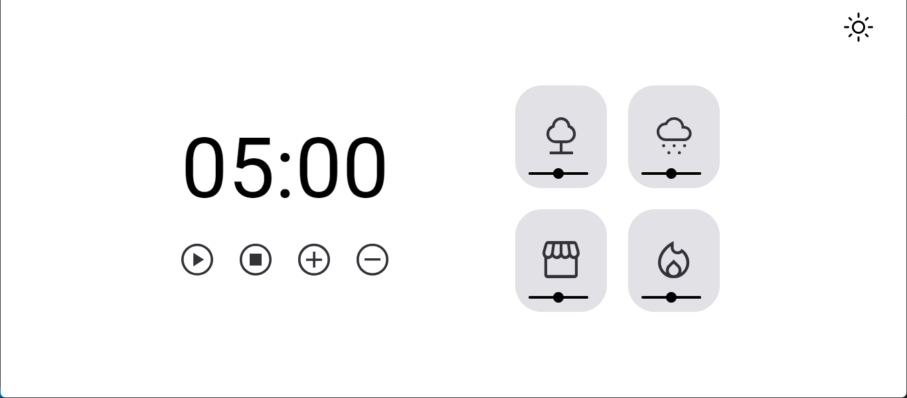
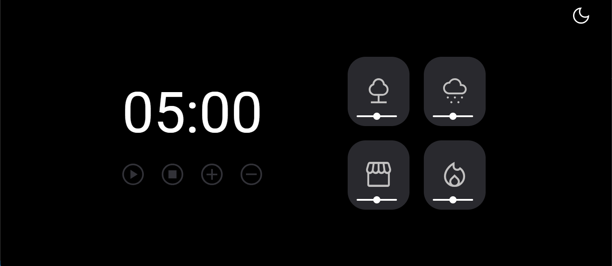
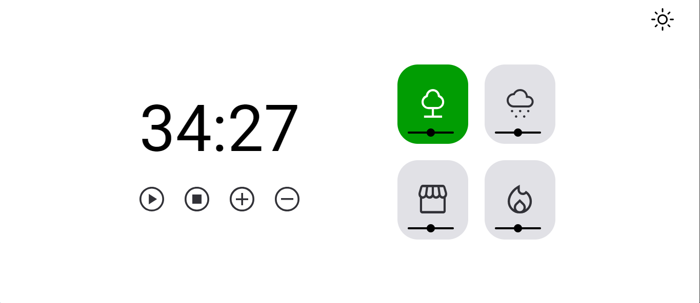
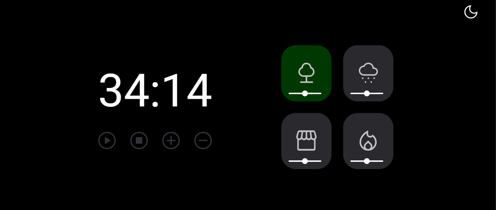
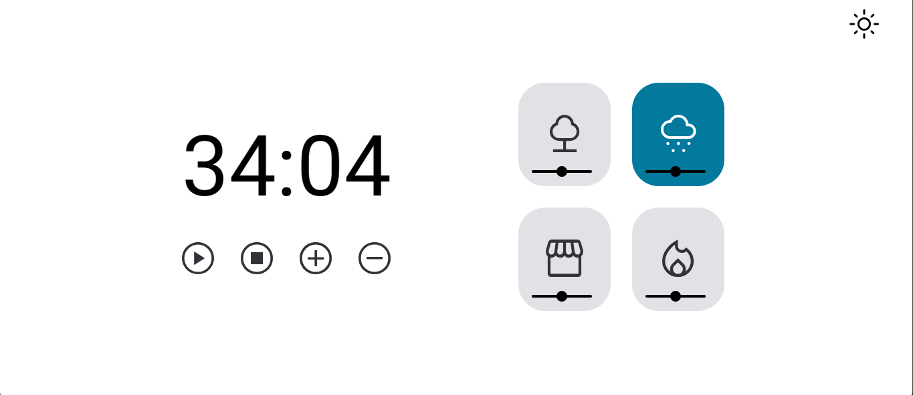
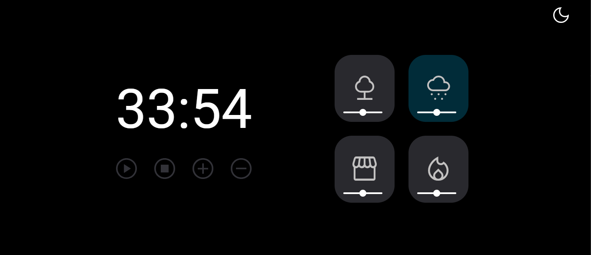
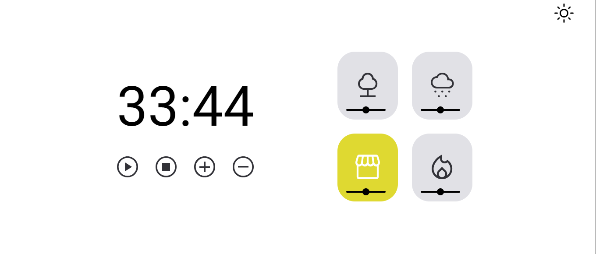
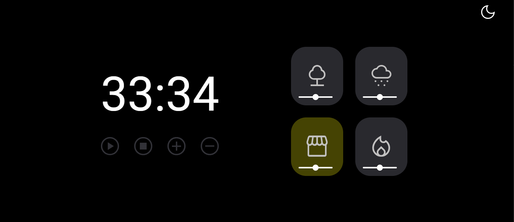
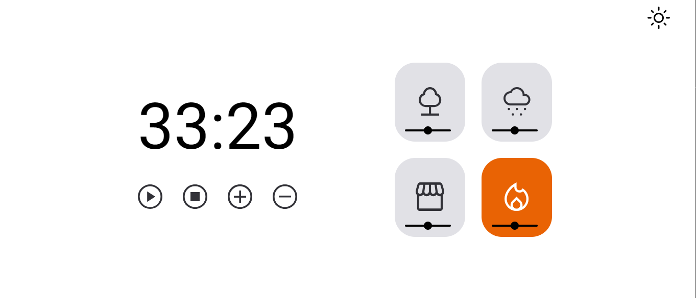
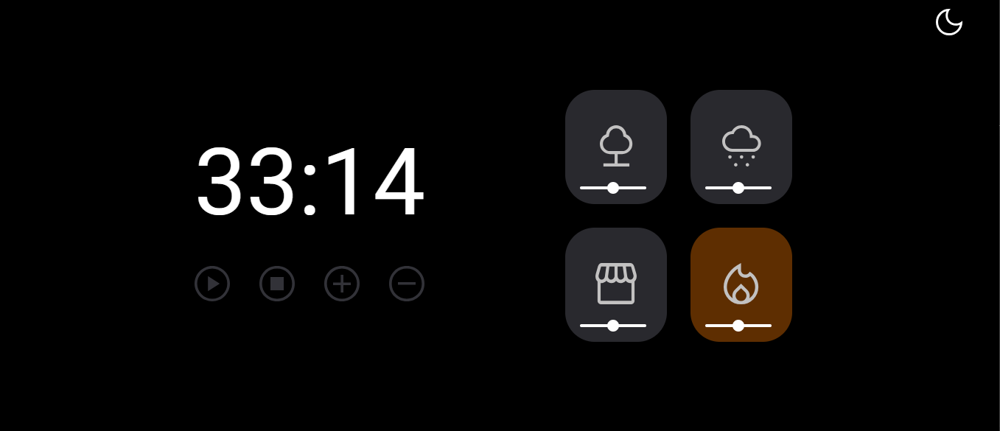

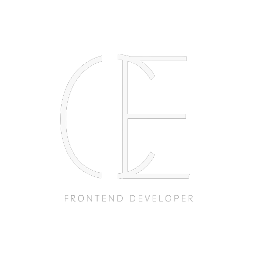

